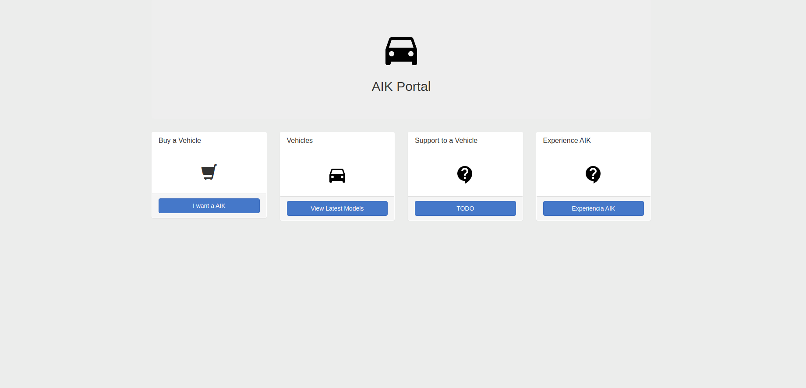
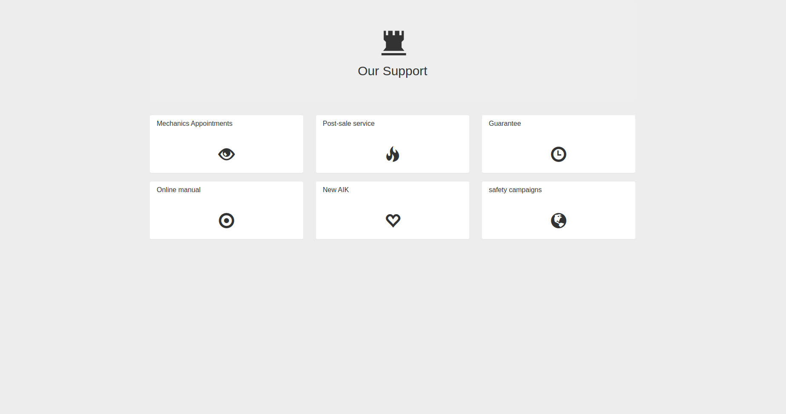

# Mono-Repo-Devops
Proyecto de Devops 2020.2, Trunk Base

Para la ejecución del proyecto en el estado actual se debe realizar lo siguiente:

1) Tener docker previamente instalado
2) Ingresar a superusuario o agregar su usuario para ser ejecutado con docker sin sudo.
3) Dar permisos al script build-docker-images.sh "chmod +x build-docker-images.sh"
4) Ejecutar el script ./build-docker-images.sh

El script contruye las imagenes docker tanto para el front como para el back.
Las imagenes tienen el nombre para esta version:
Para el front: aik-front:1.0
Para el back: aik-back:1.0
Ademas de esto el script inicializa en terraform con los archivos de configuracion y aplica los cambios necesarios para llegar al estado deseado
.....
5) 

Current State

Desired State

